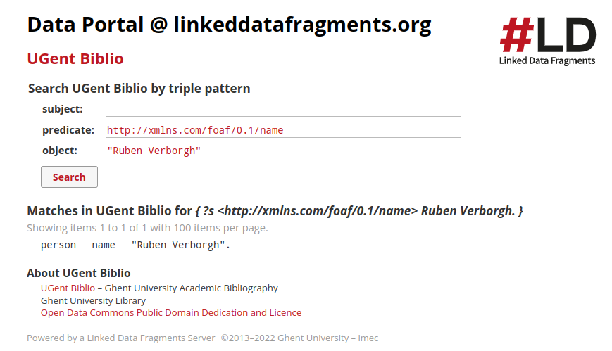

## Solution 4.1

### Using the Triple Pattern Fragments interface
To discover the identifier of Ruben Verborgh in the biblio system using the Triple Pattern Fragments interface, we have multiple options.

We can look on the `foaf:name` property, for which we then guess that this property should be `"Ruben Verborgh"`.

The url of Ruben can then by found by hovering over the `person` link in the matches, or by clicking on this `person` link and looking at the subject value of the new query.

 

If we are not sure of the foaf:name property, we can also look directly for either the `givenname` value `"Ruben"` or for the `surname` value of `"Verborgh"`. Since Ruben is a rather common name, we can look for matches in the `surname` property matching the value `Verborgh`. In this case we are lucky, as there is but a single match here.

The identifier we were looking for is: **https://biblio.ugent.be/person/002005635351#person**

### Using the Comunica SPARQL interface

Here, as in the Triple Pattern Fragments endpoint case, we can query for the identifier using the full name of Ruben Verborgh:

```sparql
PREFIX foaf: <http://xmlns.com/foaf/0.1/>
Select ?id
Where {
  ?id foaf:name "Ruben Verborgh".
} 
```
or we can query using the `givenname` and `surname` properties:

```sparql
PREFIX foaf: <http://xmlns.com/foaf/0.1/>
Select ?id
Where {
  ?id foaf:givenname "Ruben";
      foaf:surname "Verborgh".
} 
```


